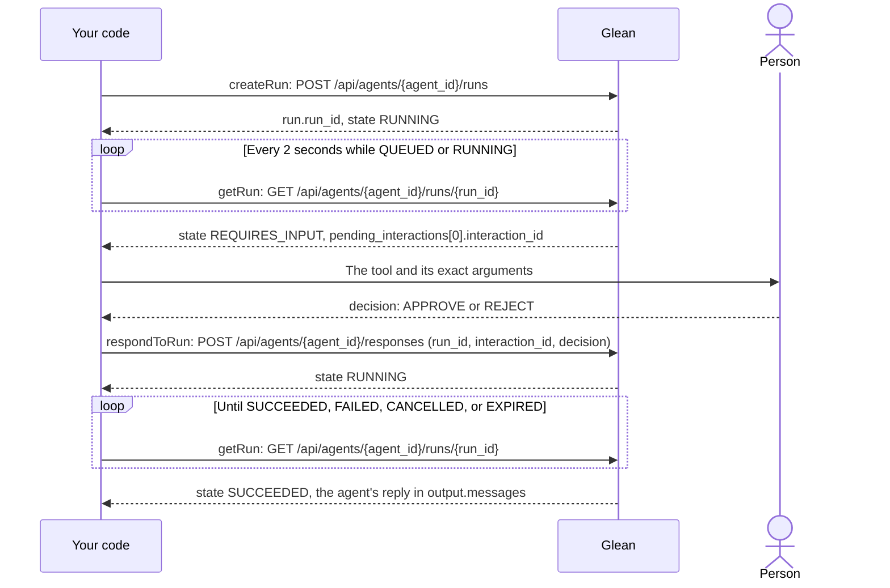

# Approve an agent action from a CLI

Start a durable agent run from TypeScript, see the exact tool call the agent
wants to make, and approve or reject it before it happens. The agent sends you
a Slack direct message, so the only thing it can change is your own DMs.

A durable run lives on the server, not in your HTTP connection. When the agent
reaches a tool that needs confirmation, the run stops in `REQUIRES_INPUT` with
the stored tool call. Your code reads it, shows it to a person, and sends the
decision. The same run then continues.

The example uses `@gleanwork/api-client@0.20.15`. Sign-in uses the official
`glean-auth` CLI and `createGleanTokenProvider` from `@gleanwork/auth`, so the
session refreshes while a run waits for you.

## Prerequisites

- Node.js 22.12+ and npm
- A Glean instance with durable agent runs available
- Access to Agent Builder, and Slack Actions enabled with your Slack account
  connected, so the agent can use **Send Slack message to user**
- Permission to sign in with the **`agents`** scope

## 1. Copy and test

```bash
npx -y tiged@2.12.8 gleanwork/glean-cookbook/recipes/human-in-the-loop-agent human-in-the-loop-agent
cd human-in-the-loop-agent && npm ci
npm test
```

The tests run the real SDK against local HTTP handlers. They don't sign in or
contact Glean or Slack. Run every later command from this directory.

## 2. Create the agent

In Glean, open the **Agent library**, click **Create agent**, and keep **Auto
mode**. Then set up the agent in the configuration tabs:

1. **Name:** `Cookbook approval demo`.
2. **Instructions:** paste this text:

   ```text
   You send the user a Slack direct message.

   Call "Send Slack message to user" exactly once, addressed to the current user,
   with the user's message text unchanged as the message body. Do not call any
   other tool. After the tool returns, reply with one sentence saying whether the
   message was sent. If the call is rejected, say it was not sent and stop.
   ```

3. **Tools:** under **Slack Actions**, select **Send Slack message to user**.
   Leave **Run without confirmation** unchecked. That setting is the approval
   boundary this recipe demonstrates.
4. **Triggers:** keep **Manual run** with **Chat message** input.
5. Click **Save**. Draft autosave alone doesn't publish, and API runs use the
   saved agent.

Copy the agent ID from the page URL: the 32-character ID after `/agents/`.

Why not ship the agent as a spec file? A spec refers to Slack by a tool
provider ID that is different on every Glean instance, so a file that works on
one instance silently loses its Slack tool on another. Building it in Agent
Builder takes a minute and works everywhere.

## 3. Sign in

```bash
npm run login -- --email "<work-email>"
```

Complete browser sign-in yourself. `glean-auth` finds your Glean backend from
your email and stores a refreshable session outside this project.

If you can't sign in with OAuth, copy `.env.example` to `.env` and set
`GLEAN_API_TOKEN` to a user-scoped token with the `agents` scope. It isn't
refreshed, so a run waiting for you can outlive it. Never paste a token into a
chat or a command.

## 4. Run it

```bash
npm start -- --agent-id "<agent-id>" --email "<work-email>" --show-json
```

The command starts one durable run, waits for the agent, and shows you what it
wants to do:

```text
The agent is waiting for your approval before it runs this tool:

Tool:        Send Slack message to user
What it does: Glean will send a direct message in Slack to the current user.
Arguments:
  {
    "message": "Cookbook approval test 2026-09-28T18:20:02.674Z"
  }

Approve (a), reject (r), cancel the run (c), or press Enter to decide later:
```

- **`a`** approves that one call. The DM arrives in Slack and the run succeeds.
- **`r`** rejects it. The agent says the message wasn't sent, and nothing
  arrives.
- **`c`** cancels the run.
- **Enter** leaves the run waiting and sends nothing.

Pass `--message "<text>"` to choose the text; by default it's a timestamped
test message. Set `GLEAN_AGENT_ID` in `.env` to skip `--agent-id`.

`--show-json` shows each API call as the run goes: the SDK method and HTTP
request, such as `respondToRun: POST /api/agents/{agent_id}/responses`, then
the request body it sent and the response Glean returned. Polls where the run
didn't change are skipped. Responses are shown as the SDK parsed them. The JSON
includes the agent's messages and tool arguments, escaped like the review
above, so keep it out of shared logs. Leave the flag off to see only the
review. [How it works](#how-it-works) shows which values carry from one call to
the next.

If the run finishes without asking, the CLI says so. That means the tool isn't
selected, **Run without confirmation** is checked, or the agent wasn't saved.

## 5. Pick a run back up

Closing the CLI, pressing Ctrl-C, or reaching the 120-second wait doesn't
cancel the run. The CLI prints the full command to continue, with the run ID
filled in:

```bash
npm start -- resume --agent-id "<agent-id>" --run-id "<run-id>" --email "<work-email>"
npm start -- status --agent-id "<agent-id>" --run-id "<run-id>" --email "<work-email>"   # the run as JSON
npm start -- cancel --agent-id "<agent-id>" --run-id "<run-id>" --email "<work-email>"
```

A resumed run can take a few minutes to finish after a decision. If the wait
runs out, `resume` again.

Without a terminal to ask in (for example, when a coding assistant runs the
command), `resume` never decides. It shows the pending call and prints a
command bound to its `interaction_id`:

```bash
npm start -- resume --agent-id "<agent-id>" --run-id "<run-id>" --decision reject --interaction-id "<interaction-id>" --email "<work-email>"
```

Only run a decision after a person has reviewed that call.

## Verify

1. Run step 4 and approve. Exactly one DM arrives, and the run succeeds.
2. Run step 4 again and reject. No DM arrives, and the agent replies that the
   message wasn't sent.
3. Run step 4 again and press Enter. Nothing arrives. Then `resume` that run
   and cancel it (`c`). The run is cancelled with nothing pending.

Maintainers can record those three run IDs and run
`mise exec -- pnpm verify:recipe human-in-the-loop-agent` from the cookbook
root. It reads the runs' final state only. It can't see Slack, so it reports
partial verification.

## How it works

Each call needs a value from an earlier response. Keep the `run_id` from the
start, poll until the run needs a decision, and answer with the
`interaction_id` the person reviewed:



[`api-flow/`](api-flow/) has the request and response bodies of one approved
run, with example IDs and empty messages left out. The tests serve them to the
real SDK, so they match what the CLI sends and what `--show-json` prints.

| SDK method (`glean.agents`)                                               | HTTP request                                |
| ------------------------------------------------------------------------- | ------------------------------------------- |
| `createRun({ execution_mode: 'DURABLE', stream: false, … }, id)`          | `POST /api/agents/{agent_id}/runs`          |
| `getRun(id, runId)`                                                       | `GET /api/agents/{agent_id}/runs/{run_id}`  |
| `respondToRun({ run_id, responses: [{ interaction_id, decision }] }, id)` | `POST /api/agents/{agent_id}/responses`     |
| `cancelRun({ run_id }, id)`                                               | `POST /api/agents/{agent_id}/cancellations` |

[`src/workflow.ts`](src/workflow.ts) is the decision loop and
[`src/runs.ts`](src/runs.ts) wraps the SDK. Things to keep when you build your
own approval screen:

- **Decide on the call you showed.** Send the `interaction_id` the person
  reviewed, never a newly polled one. A decision can't edit the arguments; to
  change them, reject and start again.
- **One decision covers one call.** If the agent pauses again, show the new
  call. This CLI stops instead of reusing the first decision.
- **Don't retry a start.** Retrying a start after an unknown outcome creates
  a second run. The client never retries on its own; after a network error,
  check the run with `status` before doing anything else.
- **Treat arguments as untrusted text.** The model writes them. The CLI escapes
  control, bidirectional, and zero-width characters before printing. The SDK
  parses them with `JSON.parse`, which rounds integers above 2^53. That's fine
  for a text message, but show the raw response for tools that take large
  numeric IDs.

## Limits

- **One pending call at a time.** The CLI refuses a run waiting on more than
  one approval. Cancel it instead.
- **Durable isn't crash recovery.** A run survives your connection closing,
  not a server worker crashing. An active turn times out after 30 minutes.
  Runs waiting for approval don't expire through that timeout.
- **Cancelling isn't undo.** It stops future work. A tool call that already
  ran stays done.

## Cleanup

Delete or archive the `Cookbook approval demo` agent in Agent Builder when
you're done. Nothing here deletes runs, messages, or agents.
